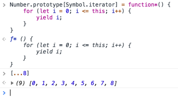

## Iterators and Generators

### Iterators: Built-in iterators

```js
var str = "Hello";
var world = ["W","o","r","l","d"];

var it1 = str[Symbol.iterator]();
var it1 = world[Symbol.iterator]();

it1.next(); // { value: "H", done: false }
it1.next(); // { value: "e", done: false }
it1.next(); // { value: "l", done: false }
it1.next(); // { value: "l", done: false }
it1.next(); // { value: "o", done: false }
it1.next(); // { value: undefined, done: true }

it2.next(); // { value: "W", done: false }
// ..
```

### Iterators: Imperative iteration

// TODO: copy from slide #25

### Iterators: Declarative iteration

// TODO: copy from slides #26

```js
var str = "Hello";

var letters = [...str];
letters;
// ["H","e","l","l","o"]
```

### Iterators: objects are not iterable

```js
var obj = {
    a: 1,
    b: 2,
    c: 3
};

for (let v of obj) {
    console.log(v);
}
// TypeError!
```

### Iterators: Imperative iterator

> This example is the actual, proper use case of the arrow function

// TODO: copy from slides #29

### Iterators: Generator

```js
function *main() {
    yield 1;
    yield 2;
    yield 3;
    return 4; // bad idea to 'return' values from generators, you should use 'yield' in generators since regular iterators don't include the return line
}

var it = main();

it.next(); // { value: 1, done: false }
it.next(); // { value: 2, done: false }
it.next(); // { value: 3, done: false }
it.next(); // { value: 4, done: true }

[...main()];
// [1,2,3]
```

> Using a while-true function inside a generator is one of the only situations where a while-true function could be used and doesn't result in an infinite loop

> A generator's purpose is to give out values

### Iterators: Declarative iterator

To make a automatic iterator:

```js
var obj = {
    a: 1,
    b: 2,
    c: 3,
    *[Symbol.iterator](){
        for (let key of Object.keys(this)) {
            yield this[key];
        }
    }
};

[...obj];
// [1,2,3]
```

> Standard iterators are now on all build-in data types include the following methods with their own iterators:
> * values
> * keys
> * entries

You can pass parameters into the iterator if you want to expose further configurations

### Exercise 4

Complete the following numbers iterator object with all that was learned earlier

```js
var numbers = {
    // ..
};

// should print 0..100 by 1s
for (let num of numbers) {
    console.log(num);
}

// should print 6..30 by 4s
console.log("My lucky numbers are: ____");

// Hint:
//     [...numbers[Symbol.iterator]( ?? )]
```

```js
var numbers = {
    *[Symbol.iterator]({start = 0, end = 100, step = 1} = {}){
        for (let i = start; i <= end; i += step) {
            yield i;
        }
    }
};

// should print 0..100 by 1s
for (let num of numbers) {
    console.log(num);
}

// should print 6..30 by 4s
console.log(`My lucky numbers are: ${
    [...numbers[Symbol.iterator]({
        start: 6,
        end: 30,
        step: 6
    })]
}`);
```

### Ranges

```js
Number.prototype[Symbol.iterator] = function*() {
    for (let i = 0; i <= this; i++) {
        yield i;
    }
}
[...8];
```

