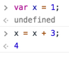

# JavaScript: The Recent Parts (ES6)

Training by: Kyle Simpson (gitify@gmail.com)

Thursday October 4, 2018

-------

## Rest/Spread Operator

> Imperative: code that focuses on how to do something (the default way that people are taught)
>
> Declarative: code that focuses on the outcome and the what and why (the ideal way of doing code)

### Rest: imperative

```js
function lookupRecord(id) {
    var otherParams = [].slice.call( arguments, 1 );

    // ..
}
```

### Spread: imperative

```js
function lookupRecord(id) {
    var otherParams = [].slice.call( arguments, 1 );
    otherParams.unshift(
        "people-records", id.toUpperCase()
    );
    return db.lookup.apply( null, otherParams );
}
```

### Rest (aka "gather"): declarative

This gathers up items into an array

```js
function lookupRecord(id,...otherParams) {
    // ..
}
```

### Spread: declarative

This does the same thing as the imperative spread

```js
function lookupRecord(id,...otherParams) {
    return db.lookup(
        "people-records", id, ...otherParams
    );
}
```

> If in an assignment context, ... gathers.
>
> If in a value list, ... spreads

### More examples

#### Example 1 (equivalent code blocks)

```js
var a = [1,2,3];
var b = [4,5,6];
var c = [0].concat(a,b,[7]); // c = [0, 1, 2, 3, 4, 5, 6, 7]
```

```js
var a = [1,2,3];
var b = [4,5,6];
var c = [0,...a,...b,7]); // c = [0, 1, 2, 3, 4, 5, 6, 7]
```

#### Example 2 (equivalent code blocks)

```js
function foo(a,b) {
    return [0].concat(a,b,[7])
}

var a = [1,2,3];
var b = [4,5,6];
var c = foo(a, b); // c = [0, 1, 2, 3, 4, 5, 6, 7]

```

```js
function foo(a,b,...c) { // spreads
    // a = 1
    // b = 2
    // c = [3]
    return [a,b,...c];
}

var a = [1,2,3];
var b = [4,5,6];
var c = [0,...a,...b,7];
// c = [0, 1, 2, 3, 4, 5, 6, 7]

var d = foo(...a); // gathers
// d = [1, 2, 3]
```

#### Example 3

An spread operator on nothing returns an empty array

```js
var a = [1,2,3];
var b = [4,5,6];
var c = [0,...a,...b,7]); // c = [0, 1, 2, 3, 4, 5, 6, 7]

function foo(x,y,z) {
    console.log(x,y,z); // [123], [456], []
    // x = [123],
    // y = [456],
    // z = []
}
foo(a,b);
```

#### Example 4

```js
var a = [1,2,3];
var b = [4,5,6];
var c = [0,...a,...b,7]); // c = [0, 1, 2, 3, 4, 5, 6, 7]

function foo(x,y,...z) {
    console.log(x,y,z);  // 0, 1, [2, 3, 4, 5, 6, 7]
    // x = 0
    // y = 1
    // z = [2, 3, 4, 5, 6, 7]
}
foo(...c);
```

### Exercise 1

#### Make the following code return true:

```js
function foo() { }

function bar() {
    var a1 = [ 2, 4 ];
    var a2 = [ 6, 8, 10, 12 ];

    return foo(); // foo()
}

console.log(
    bar().join("") === "281012" // false
);
```

#### Solution:

```js
function foo(x, y, z, ...other) {
    // x = 2
    // y = 4
    // z = 6
    // other = [8, 10, 12]
    return [x, ...other] // [2, 8, 10, 12]
}

function bar() {
    var a1 = [ 2, 4 ];
    var a2 = [ 6, 8, 10, 12 ];

    return foo(...a1, ...a2); // foo(2, 4, 6, 8, 10, 12)
}

console.log(
    bar().join("") === "281012" // true
);
```

#### How this can be used:

Function to always remove the first 2 items

```js
function dump2(x, y, ...other) {
    // x = 1
    // y = 2
    // other = [3, 4, 5]
    return other;
}

var a = [1, 2, 3, 4, 5]
var b = dump2(...a);
// b = [3, 4, 5]
```

> Using the arrow functions doesn't always mean that it's better, and is more readable
>
> Imperative
>
>```js
>[1, 2, 3, 4, 5].map(x => x * 2);
>```
>
> Declarative
>
>```js
>[1, 2, 3, 4, 5].map(function doubleIt(x) {
>    return x * 2;
>})
>```

## Destructuring

> _Decomposing_ a _structure_ into its individual parts

### Destructuring: imperative

```js
var tmp = getSomeRecords();

var first = tmp[0];
var second = tmp[1];

var firstName = first.name;
var firstEmail = first.emal !== undefined ?
    first.email :
    "nobody@none.tld";

var secondName = second.name;
var secondEmail = second.email !== undefined ?
    second.email :
    "nobody@none.tld";
```

### Destructuring: declarative

```js
var [
    {
        name: firstName,
        email: firstEmail = "nobody@none.tld"
    },
    {
        name: secondName,
        email: secondEmail = "nobody@none.tld"
    }
] = getSomeRecords();
```

> The business logic and function calls don't belong in the destructuring

### Examples

#### Example 1

```js
function foo() {
    return [1,2,3];
}

var tmp = foo();
var a = tmp[0]; // 1
var b = tmp[1]; // 2
var c = tmp[2]; // 3
```

```js
function foo() {
    return [1,2,3];
}

var [
    a,
    b,
    c
] = foo();
// a = 1
// b = 2
// c = 3
```

> It is highly recommended that you split the destructuring into multiple lines to make it more readable.
>
> Only use 1 line if there are only 1 or 2 elements

#### Example 2

```js
function foo() {
    return [1,2];
}

var tmp = foo();
var a = tmp[0]; // 1
var b = tmp[1]; // 2
var c = tmp[2]; // undefined
```

```js
function foo() {
    return [1,2];
}

var [
    a,
    b,
    c
] = foo();
// a = 1
// b = 2
// c = undefined
```

#### Example 3

> Only need to destructure the parts that you care about

```js
function foo() {
    return [1,2,3,4];
}

var tmp = foo();
var a = tmp[0]; // 1
var b = tmp[1]; // 2
var c = tmp[2]; // 3
```

```js
function foo() {
    return [1,2,3,4];
}

var [
    a,
    b,
    c
] = foo();
// a = 1
// b = 2
// c = 3
```

#### Example 4

```js
function foo() {
    return;
}

var tmp = foo();
var a = tmp[0]; // Error
var b = tmp[1]; // Error
var c = tmp[2]; // Error
```

```js
function foo() {
    return;
}

var [
    a,
    b,
    c
] = foo(); // Error
```

#### Example 5

```js
function foo() {
    return;
}

var tmp = foo() || [];
var a = tmp[0]; // undefined
var b = tmp[1]; // undefined
var c = tmp[2]; // undefined
```

```js
function foo() {
    return;
}

var [
    a,
    b,
    c
] = foo() || []; // []
// a = undefined
// b = undefined
// c = undefined
```

#### Example 6

```js
function foo() {
    return [1,2,3,4];
}

var tmp = foo() || [];
var a = tmp[1]; // 2
var b = tmp[2]; // 3
var c = tmp[3]; // 4
```

```js
function foo() {
    return [1,2,3,4];
}

var [
    ,
    a,
    b,
    c
] = foo() || [];
// a = 2
// b = 3
// c = 4
```

#### Example 7

```js
function foo() {
    return [1,2,3,4,5,6,7,8];
}

var [
    , // Skip 1
    , // Skip 2
    , // Skip 3
    , // Skip 4
    , // Skip 5
    a,
    b,
    c
] = foo() || [];
// a = 6
// b = 7
// c = 8
```

#### Example 8

```js
function foo() {
    return [1,2,3,4,5,6];
}

var tmp = foo() || [];
var a = tmp[1]; // 1
var b = tmp[2]; // 2
var c = tmp.slice(2); // [3, 4, 5, 6]
```

```js
function foo() {
    return [1,2,3,4,5,6];
}

var [
    a,
    b
    ...c
] = foo() || [];
// a = 1
// b = 2
// c = [3,4,5,6]
```

#### Example 9

Shallow copy

```js
function foo() {
    return [1,2,3,4,5,6];
}

var [
    ...c
] = foo() || [];
// 
```

#### Example 10

```js
function foo() {
    return [1,2];
}

var [
    a,
    b
    ...c
] = foo() || [];
// a = 1
// b = 2
// c = []
```

#### Example 11

```js
function foo() {
    return [1,2];
}

var tmp = foo() || [];
var a = tmp[0]; // 1
var b = tmp[1]; // 2
var c = tmp[2] !== undefined ? tmp[2] : 42; // 42
```

```js
function foo() {
    return [1,2];
}

var [
    a,
    b,
    c = 42
] = foo() || [];
// a = 1
// b = 2
// c = 42
```

#### Example 12

```js
function foo() {
    return [1,2,3];
}

var a,b,c,tmp;

tmp = foo();
a = tmp[0]; // 1
b = tmp[1]; // 2
c = tmp[2]; // 3
```

```js
function foo() {
    return [1,2,3];
}

var a,b,c;

[
    a,
    b,
    c
] = foo();
// a = 1
// b = 2
// c = 3
```

#### Example 13

```js
function foo() {
    return [1,2,3];
}

var tmp;
var o = {};

tmp = foo();
o.a = tmp[0];
o.bbbb = tmp[1];
// o = {a: 1, bbbb: 2}
```

```js
function foo() {
    return [1,2,3];
}

var o = {};

[
    o.a, // 1
    o.bbbb // 2
] = foo();
// o = {a: 1, bbbb: 2}
```

```js
function foo() {
    return [1,2,3];
}

var o = {};
var c;

[
    o.a, // 1
    c // 2
] = foo();
// o = {a: 1}
// c = 2
```

> The [] brackets in the destructuring mean that it is an array pattern, but it is not an actual array

#### Example 14

```js
var x = 1;
var y = 2;

var tmp = x;
x = y; // x = 2
y = tmp; // y = 1
```

```js
var x = 1;
var y = 2;

[y,x] = [x,y];
// x = 2
// y = 1
```

#### Example 15

```js
var x = 1;
var y = 2;

var tmp = [x,y];
x = tmp[1]; // x = 2
y = tmp[2]; // y = 1
```

```js
var x = 1;
var y = 2;

[y,x] = [x,y];
// x = 2
// y = 1
```

#### Example 16 Associative

```js
var x = 1;
var y = 2;
var z = 3;

x = null;
y = null;
z = null;
```

```js
var x = 1;
var y = 2;
var z = 3;

x = y = z = null;
// x = null
// y = null
// z = null
```

Order of operations: 
```js
x + y * z
// equivalent to:
x + (y * z)

x = y = z = null;
// equivalent to:
x = (y = (z = null));
```

Completion results:


Note that the completion value of `var x = 1;` is undefined, while the completion value of `x = x + 3;` is the result of 4.

```js
function foo() {
    return [1,2,3];
}
var tmp = foo();
var a = foo[0];
var b = foo[1];
var c = foo[2];
// tmp = [1,2,3]
// a = 1
// b = 2
// c = 3
```

```js
function foo() {
    return [1,2,3];
}
var a,b,c, tmp;
a = (tmp = foo())[0];
// tmp = [1,2,3]
// a = [1]
```

```js
function foo() {
    return [1,2,3];
}

var a, b, c, tmp;
[a,b,c] = tmp = foo();
// a = 1
// b = 2
// c = 3
// tmp = [1,2,3]
```

```js
function foo() {
    return [1,2,3];
}

var a, b, c, tmp;
tmp = [a,b,c] foo();
// tmp = [1,2,3]
// a = 1
// b = 2
```

```js
function foo() {
    return [1,2,[3,4,5]];
}
var tmp = foo() || [];
var a = foo[0];
var b = foo[1];
var c = foo[2];
```

```js
function foo() {
    return [1,2,[3,4,5]];
}

var [
    a,
    b,
    c
] = foo() | [];
```

```js
function foo() {
    return [1,2,[3,4,5]];
}
var tmp = foo() || [];
var a = foo[0];
var b = foo[1];
var tmp2 = tmp[2];
var c = tmp2[0];
var d = tmp2[1];
```

```js
function foo() {
    return [1,2,[3,4,5]];
}

var [
    a,
    b,
    [
        c,
        d
    ]
] = foo() | [];
```

#### Example

```js
function foo() {
    return [1,2];
}
var tmp = foo() || [];
var a = foo[0]; // 1
var b = foo[1]; // 2
var tmp2 = tmp[2]; // undefined
var c = tmp2[0]; // Error
var d = tmp2[1]; // Error
```

```js
function foo() {
    return [1,2];
}
var tmp = foo() || [];
var a = foo[0];
var b = foo[1];
var tmp2 = tmp[2] !== undefined ? tmp[2] : [];
var c = tmp2[0]; // undefined
var d = tmp2[1]; // undefined
```

```js
function foo() {
    return [1,2];
}

var [
    a,
    b,
    [
        c,
        d
    ] = []
] = foo() | [];
// a = 1
// b = 2
// c = undefined
// d = undefined
```

#### Example

```js
function foo(x) {
    // x = 42
}

foo(42);
```

```js
function foo(tmp) {
    var x = tmp[0]; // x = 3
    var y = tmp[1]; // y = 4
}

foo([3,4]);
```

```js
function foo([x,y]) {

}
foo([3,4]);
```

```js
function foo([x,y]) {

}
foo(); // Error
```

```js
function foo([x = 1,y = 2]) {

}
foo();
```

```js
function foo(tmp) {
    var tmp = tmp !== undefined ? tmp : [];
    var x = tmp[0]; // undefined
    var y = tmp[1]; // undefined
}
foo([]);
```

```js
function foo([x,y] = [2,3]) {
    // x = undefined
    // y = undefined
}
foo([]);
```

```js
function foo(tmp) {
    var tmp = tmp !== undefined ? tmp : [];
    var x = tmp[0] !== undefined ? tmp[0] : 2; // x = 2
    var y = tmp[1] !== undefined ? tmp[1] : 3; // y = 3
}
foo([]);
```

```js
function foo([x = 2,y = 3]) {
    // x = 2
    // y = 3
}
foo([]);
```

> Use a linter (ex. ESLint) to make sure you remember to set the default for gracefully handle errors

### Object Destructuring

```js
function foo() {
    return { a: 1, b: 2, c: 3};
}

var tmp = foo() | {};
var a = tmp.a;
var b = tmp.b;
var c = tmp.c;
```

```js
function foo() {
    return { a: 1, b: 2, c: 3};
}

var {
    a: a,
    b: b,
    c: c
} = foo() || {};
```

Order doesn't matter
```js
function foo() {
    return { a: 1, b: 2, c: 3};
}

var {
    b: b,
    a: a,
    c: c
} = foo() || {};
```

Shorthand for if the source and target are the same
```js
function foo() {
    return { a: 1, b: 2, c: 3};
}

var {
    a,
    b,
    c
} = foo() || {};
```

#### Example

```js
var o = {
    prop: val,
    target: source
};

var {
    source: target
} = o;
```

The property name always shows up on the left
```js
var o = {
    prop: val,
    target: source
};

var {
    prop: val,
    source: target
} = o;
```

```js
var o = {
    prop: val
};

var {
    prop: val
} = o;
```

#### Example

```js
function foo() {
    return { a: 1, b: 2};
}

var tmp = foo() | {};
var a = tmp.a;
var b = tmp.b;
var c = tmp.c; // undefined
```

```js
function foo() {
    return { a: 1, b: 2};
}

var {
    a,
    b,
    c
} = foo() || {};
// c = undefined
```

#### Example: setting defaults

```js
function foo() {
    return { a: 1, b: 2};
}

var tmp = foo() | {};
var a = tmp.a;
var b = tmp.b;
var c = tmp.c !== undefined ? tmp.c : 3;
```

```js
function foo() {
    return { a: 1, b: 2};
}

var {
    a,
    b,
    c: c = 3
} = foo() || {};
```

#### Example: setting defaults

```js
function foo() {
    return { a: 1, b: 2};
}

var tmp = foo() | {};
var a = tmp.a;
var b = tmp.b;
var CCC = tmp.c !== undefined ? tmp.c : 3;
```

```js
function foo() {
    return { a: 1, b: 2};
}

var {
    a,
    b,
    c: CCC = 3 // do we have a c property, if it is undefined set CCC to 3, if c is present set CCC to c
} = foo() || {};
```

#### Example: unknown properties

```js
function foo() {
    return { a: 1, b: 2, c: 3, d: 4};
}

var tmp = foo() | {};
var a = tmp.a;
var b = tmp.b;
var other = {
    c: tmp.c,
    d: tmp.d
}
```

```js
function foo() {
    return { a: 1, b: 2, c: 3, d: 4};
}

var {
    a,
    b,
    ...other
} = foo() || {};
```

### Object Spread

```js
var o = { x: 1, y: 2, z: 3 };

var p = { ...o, w: 4};
// w = 4
```

```js
var o = { x: 1, y: 2, z: 3, w: 6 };

var p = { w: 4, ...o };
// w = 6
```

### Shallow copying

```js
var x = [...y];
var x = {...y};
```

#### Example

```js
function foo() {
    return { a: 1, b: 2, c: 3, d: 4 };
}

var o = {};

var tmp = foo() || {};
o.x = tmp.a;
o.b = tmp.b;
o.CCC = tmp.c;
```

```js
function foo() {
    return { a: 1, b: 2, c: 3, d: 4 };
}

var o = {};

{
    a: o.x, // Syntax Error due to the brackets making it a block statement
    b: o.b,
    c: o.CCC
} = foo() | {};
```

```js
function foo() {
    return { a: 1, b: 2, c: 3, d: 4 };
}

var o = {};

var{
    a: x,
    b: b,
    c: CCC
} = foo() | {};
```

```js
function foo() {
    return { a: 1, b: 2, c: 3, d: 4 };
}

var o = {};

({
    a: o.x,
    b: o.b,
    c: o.CCC
} = foo() | {});
```

#### Example

```js
function foo() {
    return { a: 1, b: 2, c: 3, d: 4 };
}

var o = {};

var tmp = foo() || {};
o.x = tmp.a;
o.b = tmp.b;
o.w = tmp.b;
o.CCC = tmp.c;
```

```js
function foo() {
    return { a: 1, b: 2, c: 3, d: 4 };
}

var o = {};

({
    a: o.x,
    b: o.b,
    b: o.w,
    c: o.CCC
} = foo() | {});
```

#### Example

```js
function foo() {
    return { a: 1, b: 2, c: 3, d: 4 };
}

var o = {};

({
    a: o.x,
    b: o.b = 2,
    b: o.w = 3,
    c: o.CCC
} = foo() | {});
```

#### Example

```js
function foo() {
    return { a: 1, b: 2, c: 3, d: 4 };
}

function bar() { return }

var o = {};

({
    a: o.x,
    b: o.b = 2,
    b: o.w = bar(), // can use a valid expression
    c: o.CCC
} = foo() | {});
```

```js
function foo() {
    return { a: 1, b: 2, c: 3, d: 4 };
}

var o = {};

({
    a: o.x,
    b: o.b = 2,
    b: o.w = bar(b), // Error, since bar doesn't know where b is coming from
    c: o.CCC
} = foo() | {});
```

#### Example

```js
function foo() {
    return { a: 1, b: 2, c: 3, d: 4 };
}

var o = {};
var OBJ;

OBJ = {
    a: o.x,
    b: o.b = 2,
    b: o.w = 3,
    c: o.CCC
} = foo() | {};
```

```js
function foo() {
    return { a: 1, b: 2, c: 3, d: 4 };
}

var o = {};

var OBJ = {
    a: o.x,
    b: o.b = 2,
    b: o.w = 3,
    c: o.CCC
} = foo() | {};
```


#### Example

```js
function foo() {
    return {
        a: 1,
        b: {
            c: 3,
            d: 4
        },
        e: 5
    }
}

var tmp = foo() || {};
var tmp2 = tmp.b;
var c = tmp2.c;
var d = tmp2.d;
```

```js
function foo() {
    return {
        a: 1,
        b: {
            c: 3,
            d: 4
        },
        e: 5
    }
}

var {
    b: {
        c,
        d
    }
} = foo() | {};
```

```js
function foo() {
    return {
        a: 1,
        b: {
            c: 3,
            d: 4
        },
        e: 5
    }
}

var {
    b,
    b: {
        c,
        d
    }
} = foo() | {};
```

#### Example

```js
function foo() {
    return {
        a: 1,
        e: 5
    }
}

var tmp = foo() || {};
var tmp2 = tmp.b; // undefined
var c = tmp2.c; // Error
var d = tmp2.d;
```

```js
function foo() {
    return {
        a: 1,
        e: 5
    }
}

var {
    b,
    b: {
        c, // Error
        d
    }
} = foo() | {};
```

#### Example

```js
function foo() {
    return {
        a: 1,
        e: 5
    }
}

var tmp = foo() || {};
var tmp2 = tmp.b !== undefined ? tmp.b || {};;
var c = tmp2.c; // undefined
var d = tmp2.d;
```

```js
function foo() {
    return {
        a: 1,
        e: 5
    }
}

var {
    b,
    b: {
        c,
        d
    } = {}
} = foo() | {};
```

#### Example

```js
function foo({ x } = {}) {
    // ..
}

foo({ x: 3 });
```

#### Example (named arguments)

```js
function foo(x,y,z,w,r,e,f,g) {
    // ..
}

foo(@r = 3); // Named arguments feature not in JavaScript
```

```js
function foo({ x,y,z,w,r,e,f,g } = {}) {
    // ..
}

foo({ w: 3, y: 2 });
```

#### Example (passing booleans)

```js
function foo({ x,y,z,w,r,e,f,g,updateStatus } = {}) {
    // ..
}

foo({ w: 3, y: 2 });

bar(/*updateStatus=*/true);
```

>You still need to remember the names of the object keys, but you can decide on a common naming scheme like:
>
>cb for callbacks
>
>v for values
>
>etc.


### Destructuring and Restructuring

```js
// most common approach, using extend(..)

var defaults = {
  url: "http://some.base.url/api",
  method: "post",
  headers: [
    "Content-Type: text/plain"
  ]
};

console.log(defaults);

// ************************

var settings = {
  url: "http://some.other.url/",
  data: 42,
  callback: function(resp) { /* .. */ }
};

// underscore extend(..)
ajax( _.extend({},defaults,settings) );

// or: ajax( Object.assign({},defaults,settings) );
```

```js
// instead, IMO better using destructuring and defaults

var defaults = ajaxOptions();  // with no arguments, returns the defaults as an object if necessary

console.log(defaults);

// ************************

var settings = {
  url: "http://some.other.url/",
  data: 42,
  callback: function(resp) { /* .. */ }
};

ajax( ajaxOptions( settings ) );  // with an argument, mixes in the settings w/ the defaults

// ************************

function ajaxOptions({
   url = "http://some.base.url/api",
   method = "post",
   data,
   callback,
   headers: [
     headers0 = "Content-Type: text/plain",
     ...otherHeaders
   ] = []
} = {}) {
   return {
     url, method, data, callback,
     headers: [
       headers0,
       ...otherHeaders
     ]
   };
}
```

Using gathering (has less documentation):

```js
// instead, IMO better using destructuring and defaults

var defaults = ajaxOptions();  // with no arguments, returns the defaults as an object if necessary

console.log(defaults);

// ************************

var settings = {
  url: "http://some.other.url/",
  data: 42,
  callback: function(resp) { /* .. */ }
};

ajax( ajaxOptions( settings ) );  // with an argument, mixes in the settings w/ the defaults

// ************************

function ajaxOptions({
   url = "http://some.base.url/api",
   method = "post",
   headers: [
     headers0 = "Content-Type: text/plain",
     ...otherHeaders
   ] = [],
   ...other
} = {}) {
   return {
     url, method, data, callback,
     headers: [
       headers0,
       ...otherHeaders
     ],
     ...other
   };
}
```

#### Example

```js
var str = "Hello world";

var re = /l(l.)/;
var x = str.match(re); // ["llo","lo"]

```

```js
var str = "Hello world";

var re = /l(l.)/;
var [,word] = str.match(re); // word = "lo"

```

### Exercise 2

#### Fix the following code to get it to return true

```js
var defaults = {
    foo: 0,
    bar: 4,
    bam: {
        qux: 0,
        qam: 14
    }
};

ajax("http://fun.tld",handleResponse);


// *******************************************************

function handleResponse(/* destructuring here */) {
    checkData({
        /* restructuring here */
    });
}

function ajax(url,cb) {
    // fake ajax response:
    cb({
        foo: 2,
        baz: [ 6, 8, 10 ],
        bam: {
            qux: 12
        }
    });
}

function checkData(data) {
    console.log(
        56 === (
            data.foo +
            data.bar +
            data.baz[0] + data.baz[1] + data.baz[2] +
            data.bam.qux +
            data.bam.qam
        )
    );
}

```

#### Solution

```js
var defaults = {
    foo: 0,
    bar: 4,
    bam: {
        qux: 0,
        qam: 14
    }
};

ajax("http://fun.tld",handleResponse);


// *******************************************************

function handleResponse({
    foo = 0,
    bar = 4,
    baz,
    bam: {
        qux = 0,
        qam = 14
    } = {}
} = {}) {

    checkData({
        foo,
        bar,
        baz,
        bam: {
            qux,
            qam
        }
    });
}

function ajax(url,cb) {
    // fake ajax response:
    cb({
        foo: 2,
        baz: [ 6, 8, 10 ],
        bam: {
            qux: 12
        }
    });
}

function checkData(data) {
    console.log(data);
    console.log(
        56 === (
            data.foo +
            data.bar +
            data.baz[0] + data.baz[1] + data.baz[2] +
            data.bam.qux +
            data.bam.qam
        )
    );
}
```

#### Ideal way of doing defaults

```js
function ajaxOptions({
    foo = 0,
    bar = 4,
    baz,
    bam: {
        qux = 0,
        qam = 14
    } = {}
} = {}) {
    // ..
}
```

## Interpolated String Literals

> These are also known as Template Strings, which is misleading since it is only used once and therefore not a template

### String Interpolation: Imperative

```js
var name = "Kyle Simpson";
var email = "gitify@gmail.com";
var title = "Teacher";

var msg = "Welcome to this class! Your " +
    title + " is " + name + ", contact: " +
    email + ".";

// Welcome to this class! Your teacher is Kyle Simpson, contact: getify@gmail.com.
```

### String Interpolation: Declarative

```js
var name = "Kyle Simpson";
var email = "gitify@gmail.com";
var title = "Teacher";

var msg = `Welcome to this class! Your ${title} is ${name}, contact: ${email}.`;

// Welcome to this class! Your teacher is Kyle Simpson, contact: getify@gmail.com.
```

> A multi-line string is a string that contains multiple lines.
>
> A string that is defined across multiple lines in your code is not a multi-line string; it is called a line continuation.

```js
var name = "Kyle Simpson";
var email = "gitify@gmail.com";
var title = "Teacher";

var msg = "Welcome to this class! Your \n" +
    title + " is " + name + ", contact: " +
    email + ".";

// Welcome to this class! Your 
// teacher is Kyle Simpson, contact: getify@gmail.com.
```

```js
var name = "Kyle Simpson",
var email = "gitify@gmail.com";
var title = "Teacher";

var msg = `Welcome to this class! Your
${title} is ${name}, contact: ${email}.`;

// Welcome to this class! Your
// teacher is Kyle Simpson, contact: getify@gmail.com.
```

> Don't use a find-and-replace all of your quotes to use the backticks, because certain things need to be regular strings

### String Interpolation: Tagged

```js
var amount = 12.3;

var msg =
    formatCurrency
`The total for your order is ${amount}`;

// The total for your
// order is $12.30
```

> The tag function is called first (ex. formatCurrency) and this is processed first
>
> Formatting functions are generally used

```js
function formatCurrency(strings,...values) {
    var str = "";
    for (let i = 0; i < strings.length; i++) {
        if (i > 0) {
            if (typeof values[i-1] == "number") {
                str += `$${values[i-1].toFixed(2)}`;
            }
            else {
                str += values[i-1];
            }
        }
        str += strings[i];
    }
    return str;
}

```

### Exercise 3

Convert the following code to using tagged string interpolation, resulting in a 'true' condition

```js
function upper(strings,...values) {}

var name = "kyle",
    twitter = "getify",
    classname = "es6 workshop";

console.log(
    `Hello ____ (@____), welcome to the ____!` ===
    "Hello KYLE (@GETIFY), welcome to the ES6 WORKSHOP!"
);
```

Solution

```js
function upper(strings,...values) {
    var str = "";
    for (let i = 0; i < strings.length; i++) {
        if (i > 0) {
            str += `${values[i-1].toUpperCase()}`;
        }
        str += strings[i];
    }
    return str;
}

var name = "kyle",
    twitter = "getify",
    classname = "es6 workshop";

console.log(
    upper
    `Hello ${name} (@${twitter}), welcome to the ${classname}!` ===
    "Hello KYLE (@GETIFY), welcome to the ES6 WORKSHOP!"
);
```

### Example: Logger

https://gist.github.com/getify/d8e5349d7cf654c313ff623f0506b8d8

```js
function logger(strings,...values) {
    var str = "";
    for (let i = 0; i < strings.length; i++) {
        if (i > 0) {
            if (values[i-1] && typeof values[i-1] == "object") {
                if (values[i-1] instanceof Error) {
                    if (values[i-1].stack) {
                        str += values[i-1].stack;
                        continue;
                    }
                }
                else {
                    try {
                        str += JSON.stringify(values[i-1]);
                        continue;
                    }
                    catch (err) {}
                }
            }
            str += values[i-1];
        }
        str += strings[i];
    }
    console.log(str);
    return str;
}

var v = 42;
var o = { a: 1, b: [2,3,4] };

logger`This is my value: ${v} and another: ${o}`;
// This is my value: 42 and another: {"a":1,"b":[2,3,4]}
```
